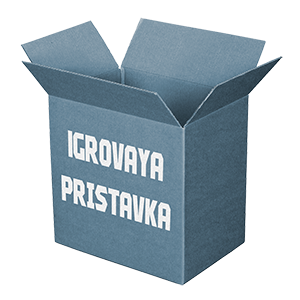

# Igrovaya Pristavka



## Getting Started 🚀

In order to start the project:

### Prerequisites 📋

- [Vagrant](https://www.vagrantup.com/downloads.html) software.
- [VirtualBox](https://www.virtualbox.org/wiki/Downloads) software.
- [PHP](https://www.php.net/downloads) interpreter.
- [Composer](https://getcomposer.org/download/) interpreter.
- [NPM and Node](https://www.npmjs.com/get-npm) interpreters.


### Installation 🔧

On windows ```vendor\\bin\\homestead make``` and on MAC and linux ```` php vendor/bin/homestead make````.

Run ```composer install``` and then ```npm install && npm run development```.

Set on your virtual host ```homestead.test 192.168.10.10``` or whatever you want and run ```vagrant up```.


Access to the project [here](http://homestead.test).

## Working with 🛠️


### PHP dependencies 📦

- Appstract Laravel Blade Directives [](https://packagist.org/packages/appstract/laravel-blade-directives)
- Astrotomic Laravel Translatable [](https://packagist.org/packages/astrotomic/laravel-translatable)
- Bensampo Laravel Enum [](https://packagist.org/packages/bensampo/laravel-enum)
- Consoletvs Charts [](https://packagist.org/packages/consoletvs/charts)
- Davejamesmiller Laravel Breadcrumbs [](https://packagist.org/packages/davejamesmiller/laravel-breadcrumbs)
- Fideloper Proxy [](https://packagist.org/packages/fideloper/proxy)
- Gboquizo Morphable [](https://packagist.org/packages/fideloper/proxy)
- Igaster Laravel Theme [](https://packagist.org/packages/igaster/laravel-theme)
- Intervention Image [](https://packagist.org/packages/intervention/image)
- Jenssegers Agent [](https://packagist.org/packages/jenssegers/agent)
- Lab404 Laravel Auth Checker [](https://packagist.org/packages/lab404/laravel-auth-checker)
- Lab404 Laravel Impersonate [](https://packagist.org/packages/lab404/laravel-impersonate)
- Laravel Framework [](https://packagist.org/packages/laravel/framework)
- Laravel Tinker [](https://packagist.org/packages/laravel/tinker)
- Livewire Livewire [](https://packagist.org/packages/livewire/livewire)
- Maatwebsite Excel [](https://packagist.org/packages/laravel/tinker)
- Mariuzzo Laravel JS Localization [](https://packagist.org/packages/mariuzzo/laravel-js-localization)
- Mcamara Laravel Localization [](https://packagist.org/packages/mcamara/laravel-localization)
- Prettus L5 Repository [](https://packagist.org/packages/prettus/l5-repository)
- Spatie Laravel Medialibrary [](https://packagist.org/packages/spatie/laravel-medialibrary)
- Tightenco Ziggy [](https://packagist.org/packages/tightenco/ziggy)
- Yajra Laravel Datatables [](https://packagist.org/packages/yajra/laravel-datatables)

#### Develop dependencies 🔧
- Barryvdh Laravel IDE Helper [](https://packagist.org/packages/barryvdh/laravel-ide-helper)
- Facade Ignition [](https://packagist.org/packages/facade/ignition)
- Friends of PHP CS-Fixer [](https://packagist.org/packages/friendsofphp/php-cs-fixer)
- Fruitcake Laravel Telescope Toolbar [](https://packagist.org/packages/fruitcake/laravel-telescope-toolbar)
- Fzaninotto Faker [](https://packagist.org/packages/fzaninotto/faker)
- Gboquizo Sweet Routes [](https://packagist.org/packages/gboquizo/sweet-routes)
- Laravel Homestead [](https://packagist.org/packages/laravel/homestead)
- Larsjanssen6 Underconstruction [](https://packagist.org/packages/larsjanssen6/underconstruction)
- Mockery [](https://packagist.org/packages/mockery/mockery)
- Nunomaduro Collision [](https://packagist.org/packages/nunomaduro/collision)
- PHPMD [](https://packagist.org/packages/phpmd/phpmd)
- PHPUnit [](https://packagist.org/packages/phpunit/phpunit)
- Squizlabs PHP Code Sniffer [](https://packagist.org/packages/squizlabs/php_codesniffer)
- Roave Security-advisories [](https://packagist.org/packages/roave/security-advisories)
- Sven Artisan-View [](https://packagist.org/packages/sven/artisan-view)
- Tightenco Tlint [](https://packagist.org/packages/tightenco/tlint)

### NPM dependencies 📦
- @Fortawesome Fortawesome-Free [](https://www.npmjs.com/package/@fortawesome/fontawesome-free)
- @Tailwindcss Custom forms [](https://www.npmjs.com/package/@tailwindcss/custom-forms)
- @Tailwindcss Ui [](https://www.npmjs.com/package/@tailwindcss/ui)
- AlpineJS [](https://www.npmjs.com/package/alpinejs)
- Cookieconsent [](https://www.npmjs.com/package/cookieconsent)
- Laravel Mix Tailwind [](https://www.npmjs.com/package/laravel-mix-tailwind)
- SweetAlert2 [](https://www.npmjs.com/package/sweetalert2)
- TailwindCSS [](https://www.npmjs.com/package/tailwindcss)

#### Develop dependencies 🔧
- Cross Env [](https://www.npmjs.com/package/cross-env)
- Eslint [](https://www.npmjs.com/package/eslint)
- Laravel Localization Loader [](https://www.npmjs.com/package/laravel-localization-loader)
- Laravel Mix [](https://www.npmjs.com/package/laravel-mix)
- Resolve Url Loader [](https://www.npmjs.com/package/resolve-url-loader)
- Sass [](https://www.npmjs.com/package/sass)
- Sass Loader [](https://www.npmjs.com/package/sass-loader)
- Standard [](https://www.npmjs.com/package/standard)
- Vue Template Compiler [](https://www.npmjs.com/package/vue-template-compiler)

## Authors ✒️

This project was made by

* **Germán Boquizo Sánchez** - *Fullstack developer*
* **Guillermo Boquizo Sánchez** - *Fullstack developer*
