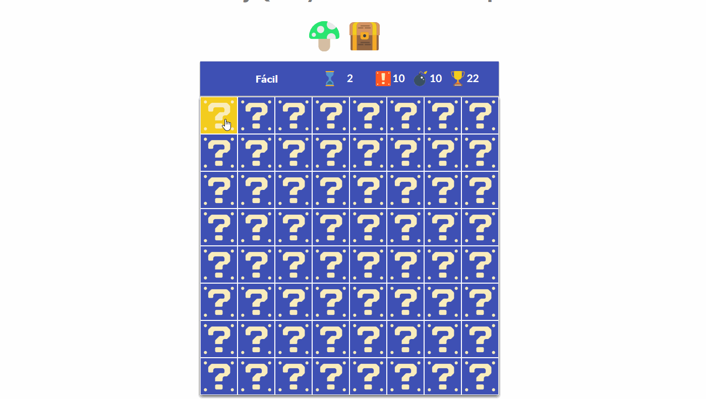

# Overview

---

- [First Section](#section-1)

<a name="section-1"></a>
### First Section

Write something cool.. 🦊

Para jugar entra en [Buscaminas con jQuery](https://iesgrancapitan-dwec.github.io/Buscaminas-Guillermo/)

**********

####  Estoy haciendo pruebas, ¿puedo ver el icono? 

Sí, para ello **selecciona el nivel de juego**, accede al modo consola del navegador e introduce ```buscaminas.mostrar()```.



**********
